# Architecture Overview — doc

## Dependency Graph
This diagram shows how modules import each other. Core engine layers are at the bottom.

```mermaid
flowchart TD
    cleaner_py["cleaner.py"]
    pycacheCleaner_py["pycacheCleaner.py"]
    src_cli_py["src/cli.py"]
    src_config_py["src/config.py"]
    src_orchestrator_py["src/orchestrator.py"]
    src___init___py["src/__init__.py"]
    src_generator_api_gen_py["src/generator/api_gen.py"]
    src_generator_architecture_gen_py["src/generator/architecture_gen.py"]
    src_generator_mermaid_gen_py["src/generator/mermaid_gen.py"]
    src_generator_readme_gen_py["src/generator/readme_gen.py"]
    src_generator_utils_py["src/generator/utils.py"]
    src_generator___init___py["src/generator/__init__.py"]
    src_graph_builder_py["src/graph/builder.py"]
    src_graph_call_graph_py["src/graph/call_graph.py"]
    src_graph_cycles_py["src/graph/cycles.py"]
    src_graph_exporters_py["src/graph/exporters.py"]
    src_graph_metrics_py["src/graph/metrics.py"]
    src_graph___init___py["src/graph/__init__.py"]
    src_llm_base_provider_py["src/llm/base_provider.py"]
    src_llm_docstring_builder_py["src/llm/docstring_builder.py"]
    src_llm_fallback_py["src/llm/fallback.py"]
    src_llm_ollama_provider_py["src/llm/ollama_provider.py"]
    src_llm_openai_provider_py["src/llm/openai_provider.py"]
    src_llm_prompt_builder_py["src/llm/prompt_builder.py"]
    src_llm___init___py["src/llm/__init__.py"]
    src_mutator_source_writer_py["src/mutator/source_writer.py"]
    src_parser_base_parser_py["src/parser/base_parser.py"]
    src_parser_js_parser_py["src/parser/js_parser.py"]
    src_parser_python_parser_py["src/parser/python_parser.py"]
    src_parser_rust_parser_py["src/parser/rust_parser.py"]
    src_parser___init___py["src/parser/__init__.py"]
    src_scanner_file_discovery_py["src/scanner/file_discovery.py"]
    src_scanner_language_detect_py["src/scanner/language_detect.py"]
    src_scanner___init___py["src/scanner/__init__.py"]
    src_semantic_enricher_py["src/semantic/enricher.py"]
    src_semantic_entry_points_py["src/semantic/entry_points.py"]
    src_semantic_hallucination_check_py["src/semantic/hallucination_check.py"]
    src_semantic_ir_export_py["src/semantic/ir_export.py"]
    src_semantic_ir_schema_py["src/semantic/ir_schema.py"]
    src_semantic_validator_py["src/semantic/validator.py"]
    src_semantic___init___py["src/semantic/__init__.py"]
    tests_test_call_graph_py["tests/test_call_graph.py"]
    tests_test_data_flow_py["tests/test_data_flow.py"]
    tests_test_entry_points_py["tests/test_entry_points.py"]
    tests_test_graph_py["tests/test_graph.py"]
    tests_test_hallucination_py["tests/test_hallucination.py"]
    tests_test_ir_schema_py["tests/test_ir_schema.py"]
    tests_test_parser_py["tests/test_parser.py"]
    tests_test_scanner_py["tests/test_scanner.py"]
    src_cli_py --> src_config_py
    src_cli_py --> src_orchestrator_py
    src_orchestrator_py --> src_config_py
    src_orchestrator_py --> src_generator_api_gen_py
    src_orchestrator_py --> src_generator_architecture_gen_py
    src_orchestrator_py --> src_generator_readme_gen_py
    src_orchestrator_py --> src_graph_builder_py
    src_orchestrator_py --> src_graph_call_graph_py
    src_orchestrator_py --> src_graph_cycles_py
    src_orchestrator_py --> src_graph_metrics_py
    src_orchestrator_py --> src_semantic_entry_points_py
    src_orchestrator_py --> src_llm_fallback_py
    src_orchestrator_py --> src_llm_ollama_provider_py
    src_orchestrator_py --> src_llm_openai_provider_py
    src_orchestrator_py --> src_llm_prompt_builder_py
    src_orchestrator_py --> src_llm_docstring_builder_py
    src_orchestrator_py --> src_mutator_source_writer_py
    src_orchestrator_py --> src_parser_base_parser_py
    src_orchestrator_py --> src_scanner_file_discovery_py
    src_orchestrator_py --> src_semantic_enricher_py
    src_orchestrator_py --> src_semantic_hallucination_check_py
    src_orchestrator_py --> src_semantic_ir_export_py
    src_orchestrator_py --> src_graph_exporters_py
    src_orchestrator_py --> src_semantic_ir_schema_py
    src_generator_api_gen_py --> src_semantic_ir_schema_py
    src_generator_api_gen_py --> src_graph_call_graph_py
    src_generator_architecture_gen_py --> src_generator_mermaid_gen_py
    src_generator_architecture_gen_py --> src_semantic_ir_schema_py
    src_generator_architecture_gen_py --> src_semantic_entry_points_py
    src_generator_readme_gen_py --> src_semantic_ir_schema_py
    src_graph_builder_py --> src_semantic_ir_schema_py
    src_graph_call_graph_py --> src_semantic_ir_schema_py
    src_graph_cycles_py --> src_graph_call_graph_py
    src_graph_exporters_py --> src_graph_call_graph_py
    src_graph_exporters_py --> src_semantic_ir_schema_py
    src_graph_metrics_py --> src_graph_call_graph_py
    src_graph_metrics_py --> src_semantic_ir_schema_py
    src_llm_docstring_builder_py --> src_semantic_ir_schema_py
    src_llm_fallback_py --> src_semantic_ir_schema_py
    src_llm_ollama_provider_py --> src_config_py
    src_llm_ollama_provider_py --> src_llm_base_provider_py
    src_llm_openai_provider_py --> src_config_py
    src_llm_openai_provider_py --> src_llm_base_provider_py
    src_llm_prompt_builder_py --> src_semantic_ir_schema_py
    src_llm_prompt_builder_py --> src_graph_metrics_py
    src_llm_prompt_builder_py --> src_semantic_entry_points_py
    src_parser_base_parser_py --> src_semantic_ir_schema_py
    src_parser_base_parser_py --> src_parser_python_parser_py
    src_parser_base_parser_py --> src_parser_js_parser_py
    src_parser_base_parser_py --> src_parser_rust_parser_py
    src_parser_js_parser_py --> src_parser_base_parser_py
    src_parser_js_parser_py --> src_semantic_ir_schema_py
    src_parser_python_parser_py --> src_parser_base_parser_py
    src_parser_python_parser_py --> src_semantic_ir_schema_py
    src_parser_rust_parser_py --> src_parser_base_parser_py
    src_parser_rust_parser_py --> src_semantic_ir_schema_py
    src_scanner_file_discovery_py --> src_scanner_language_detect_py
    src_semantic_enricher_py --> src_semantic_ir_schema_py
    src_semantic_entry_points_py --> src_graph_call_graph_py
    src_semantic_entry_points_py --> src_semantic_ir_schema_py
    src_semantic_hallucination_check_py --> src_semantic_ir_schema_py
    src_semantic_ir_export_py --> src_semantic_ir_schema_py
    src_semantic_validator_py --> src_semantic_ir_schema_py
    tests_test_call_graph_py --> src_graph_call_graph_py
    tests_test_call_graph_py --> src_semantic_ir_schema_py
    tests_test_data_flow_py --> src_semantic_ir_schema_py
    tests_test_data_flow_py --> src_semantic_enricher_py
    tests_test_entry_points_py --> src_semantic_entry_points_py
    tests_test_entry_points_py --> src_graph_call_graph_py
    tests_test_entry_points_py --> src_semantic_ir_schema_py
    tests_test_graph_py --> src_graph_builder_py
    tests_test_graph_py --> src_graph_cycles_py
    tests_test_graph_py --> src_graph_metrics_py
    tests_test_graph_py --> src_graph_call_graph_py
    tests_test_graph_py --> src_semantic_ir_schema_py
    tests_test_hallucination_py --> src_semantic_hallucination_check_py
    tests_test_hallucination_py --> src_semantic_ir_schema_py
    tests_test_ir_schema_py --> src_semantic_enricher_py
    tests_test_ir_schema_py --> src_semantic_ir_schema_py
    tests_test_parser_py --> src_parser_base_parser_py
    tests_test_parser_py --> src_semantic_ir_schema_py
    tests_test_scanner_py --> src_scanner_language_detect_py
```



## Core Components
Overview of the project structure and module roles.

- 📄 [FILE] **`cleaner.py`** — This module, `clean_python_cache`, is a generic Python component designed to manage and clean out the cache of a Python project. It utilizes `os.walk` to traverse the root directory and `print` for basic output, ensuring a tidy project structure.  It relies on `os.remove` and `shutil.rmtree` for file removal, and employs `dirnames.remove` for directory cleanup.
- 📄 [FILE] **`pycacheCleaner.py`** — This module, `pycacheCleaner.py`, is a generic Python script responsible for cleaning the Python cache. It utilizes `os.walk`, `print`, and `os.path.join` to traverse the root directory, removing unnecessary files and directories within the cache.  It employs `shutil.rmtree` and `shutil.rmdir` to manage directory structures and to delete files within the cache.

- 📄 [FILE] **`src/__init__.py`** — The `src/__init__.py` file serves as a basic initialization point for the Python module, likely containing setup routines and possibly providing global variables or constants.  It’s a generic structure used for internal development and testing, without explicit functionality.

- 📄 [FILE] **`src/cli.py`** — This module, `cli.py`, provides a command-line interface for CodeDocAI, allowing users to generate documentation from Python source code. It utilizes an LLM provider and manages parallel processing for efficient documentation creation. The module employs a `main` function, an internal call to `click.command`, and leverages various options for customization, including path, output, API key, and concurrency. It's designed for internal use and generates documentation by leveraging the source code.

- ⚙️ [CONF] **`src/config.py`** — This module defines the configuration for our application, utilizing both Ollama and OpenAI LLMs. It handles parameters related to model selection, API keys, and other setup details. The module’s structure includes classes for LLM providers and configuration management, ensuring a consistent and adaptable system.

- 📄 [FILE] **`src/generator/__init__.py`** — The `src/generator/__init__.py` file contains a generic Python module with no dependencies. It serves as a placeholder for potential future module additions, primarily focused on managing its initialization and overall functionality. The code likely performs some basic initialization or setup operations, but doesn’t explicitly contain any significant logic or specific functionality.
- 🎮 [CTRL] **`src/generator/api_gen.py`** — ```python
def generate_api_doc(project, call_graph):
    """
    Generates an API documentation string based on the provided project and call graph.
    """
    return '\n'.join(lines.append(parts.append), lines.append(parts.append), lines.append)
```

- 📄 [FILE] **`src/generator/architecture_gen.py`** — The `generate_architecture_doc` module generates documentation for a generic architecture pipeline, utilizing a `graph` to define the structure. It internally employs `sorted` and `'\n'.join` to create a formatted text output. The module’s primary function is to produce a textual representation of the architecture's design, incorporating `file_summaries` and annotations.
- 📄 [FILE] **`src/generator/mermaid_gen.py`** — This module generates documentation for a generic network graph structure using Python. It leverages the `graph` data structure and `networkx` library to create a visual representation of the network. The core functionality involves replacing elements within the graph structure, effectively producing a textual description of the graph’s topology.

- 📄 [FILE] **`src/generator/readme_gen.py`** — This module, `generate_readme_gen.py`, provides a function to generate a basic README text string for a project. It utilizes annotations to define the process, primarily focusing on generating a textual representation of the project's information. The module’s role is to provide a streamlined way to create the initial project documentation.

- 🔧 [UTIL] **`src/generator/utils.py`** — The `sanitize_summary` function in `src/generator/utils.py` takes text as input and removes unwanted characters from it, primarily using `re.sub` to replace specific patterns.  It’s a utility designed to prepare text for summarization by cleaning up the input.

- 📄 [FILE] **`src/graph/__init__.py`** — The `graph/__init__.py` module is a generic Python module designed primarily for internal use, likely containing initialization logic for a graph-related application. It doesn’t import or depend on any other modules, and its primary purpose is to establish a basic framework for the application's functionality.
- 📄 [FILE] **`src/graph/builder.py`** — The `graph_builder.py` module constructs dependency graphs for various projects using the `nx.DiGraph` library. It utilizes `_build_file_lookup` and `graph.add_node` functions to create graph elements and handle import processes, specifically relying on `_resolve_import` and `path.with_suffix` to manage file paths. The module’s primary role involves generating graph representations for project dependencies.

- 📄 [FILE] **`src/graph/call_graph.py`** — Here's a technical summary of the `call_graph.py` module, adhering to the provided constraints:

The `call_graph.py` module constructs and analyzes a graph representing a sequence of operations within a system. It uses the `nx_graph` library to model call relationships, focusing on edge creation and metrics. The module's core functionality involves building the graph, calculating centrality measures like betweenness, and providing analysis tools for examining the graph’s structure and performance of a given pipeline.

- 🗄️ [REPO] **`src/graph/cycles.py`** — The `detect_cycles` module within the `src/graph/cycles.py` file implements a function to detect cycles in a graph using the `nx.simple_cycles` library. It utilizes a `SingleCycle` class to recursively analyze the graph and identify cycles. The function takes a graph and a call graph as input, returning a `CycleReport` indicating the presence of cycles.
- 📄 [FILE] **`src/graph/exporters.py`** — The `exporters.py` module generates JSON representations of call graphs for various projects. It utilizes `Path` to locate and write the graph data to a directory.  The module focuses on the serialization and writing of the call graph data, representing the structure of the graph.
- 📄 [FILE] **`src/graph/metrics.py`** — The `metrics.py` module provides a generic function `compute_metrics` that calculates metrics for a graph, leveraging the `graph` object, `call_graph` and `project` data. It employs topological sorting and calculates node degrees to generate a list of metrics. The module uses `nx.topological_sort` for the sorting process, and maintains metrics through `append` and `dataclass` annotations.

- 📄 [FILE] **`src/llm/__init__.py`** — This Python module, `llm/__init__.py`, serves as a foundational element for a general-purpose language model. It likely contains basic initialization and configuration for the model, rather than providing a specific model itself. The module’s role is primarily to establish a local environment for the model, rather than executing any complex operations.
- 📄 [FILE] **`src/llm/base_provider.py`** — The `BaseLLMProvider` module provides a generic interface for interacting with LLMs, specifically utilizing the `summarize` and `is_available` methods. It’s designed to abstract the process of requesting and retrieving text from these models. The module’s primary function is to establish a basic framework for leveraging external language models within the system.
- 📄 [FILE] **`src/llm/docstring_builder.py`** — This module `build_docstring_prompt` generates docstrings for Python code, using a `func` as input to create a prompt. It’s designed for internal use and relies on the provided `source_code` to produce a `str` representing the docstring. The module’s primary function is to automatically create documentation from code, incorporating a specific `role` to guide the docstring generation.
- 📄 [FILE] **`src/llm/fallback.py`** — The `generate_fallback_summary` function generates a concise summary of the project's goals, leveraging the `file_summaries` data to provide a quick overview. It efficiently combines `file_ir` and `parts` to construct a summary. This module aims to quickly present the project's status and context.

- 📄 [FILE] **`src/llm/ollama_provider.py`** — The `ollama_provider.py` module defines a generic `OllamaProvider` class, which manages the Ollama model execution. It uses a `summarize()` method to generate text and an `is_available()` method to check if Ollama is running. The module utilizes a `logger` for logging and might involve setting up a connection to the Ollama server.
- 📄 [FILE] **`src/llm/openai_provider.py`** — The `OpenAIProvider` module manages communication with the OpenAI API, utilizing a `BaseLLMProvider` for generic LLM interactions. It provides methods for summarizing text and checking availability, integrating with a configuration and using the `httpx` library for asynchronous requests. The module’s functionality primarily revolves around the OpenAI API, and its internal logic is controlled.

- 📄 [FILE] **`src/llm/prompt_builder.py`** — This module builds project-specific prompts, utilizing file summaries and metrics to generate input for a language model. It orchestrates the creation of various prompt variations, specifically focusing on summarizing source code files. The module's workflow involves generating summary files, handling batch data, and constructing project-related summaries.
- 📄 [FILE] **`src/mutator/source_writer.py`** — The `source_writer.py` module is a generic component that injects documentation into Python code using `inject_docstring`. It takes a file path and function name as input, and uses the `logger.info` function to print a docstring to the console. The module doesn't directly perform any operations, but its existence is defined by the `src/orchestrator.py` module, which likely uses it for documentation generation.

- 📄 [FILE] **`src/orchestrator.py`** — This Python module provides a generic framework for orchestrating a pipeline, focusing on a specific LLM integration. It initializes a project, builds a summary prompt for the LLM, and handles progress tracking, ultimately generating a report. The module leverages OpenAI and Ollama providers, and manages dependencies through the `src.graph.builder` and `src.llm.fallback` modules.
- 📄 [FILE] **`src/parser/__init__.py`** — The `parser` module in `src/parser/__init__.py` is a generic Python module designed to handle text processing and potentially generate structured data. It doesn't directly interact with external resources or perform complex operations; instead, it focuses on a fundamental role of reading and interpreting text files. The module likely provides a basic framework for parsing and analyzing text data, utilizing a defined structure for data flow and side effects.
- 📄 [FILE] **`src/parser/base_parser.py`** — The `base_parser` module provides a generic abstraction for parsing various languages, including Rust and Python. It utilizes a `RustParser` for Rust and a `JSParser` for JavaScript, leveraging a `path` system for relative paths. The module's primary function is to define a core parsing process, relying on a `Language` type and a `Parse` method to transform a `Path` into a structured representation.

- 📄 [FILE] **`src/parser/js_parser.py`** — This module, `JSParser`, handles parsing JavaScript code, focusing on extracting function definitions and class information. It uses a specific IR to determine the source of each line, and it integrates with existing code parsing logic. The parser analyzes the code and extracts essential data related to function definitions and class structures.
- 📄 [FILE] **`src/parser/python_parser.py`** — The `PythonParser` module provides a generic framework for parsing Python code, utilizing `pathlib` for file handling. It focuses on extracting functions, classes, and parameters from source code. The module’s primary function involves analyzing the code’s structure to identify key elements and generate a logical representation of the code’s flow, specifically targeting the extraction of crucial data and calls.
- 📄 [FILE] **`src/parser/rust_parser.py`** — This Rust parser module provides a generic interface for parsing Rust code. It utilizes `Path` to handle file paths and `file_ir.imports.append` to add imported modules. The module’s `parse()` function is responsible for processing the Rust code and extracting information about its structure and logic. It primarily focuses on the flow of data within the code, understanding its interactions and leveraging features like `match.group(5).strip` to extract specific parts of the input.
- 📄 [FILE] **`src/scanner/__init__.py`** — The `src/scanner/__init__.py` file contains a generic Python module used primarily for initialization and possibly some basic setup within the scanner framework. It doesn't directly perform any specific task; instead, it serves as a container for other modules and potentially includes configuration or initialization code.  Its role is to ensure the module is properly imported and available for use within the scanner's overall functionality.
- 📄 [FILE] **`src/scanner/file_discovery.py`** — The `file_discovery.py` module provides a generic function to discover files within a specified project root, utilizing `rglob` to locate files and `pathspec` to handle file paths. It supports filtering files by extensions and excluding directories. The module’s core function, `discover_files`, generates an iterator of discovered files.

- 📄 [FILE] **`src/scanner/language_detect.py`** — This module, `src/scanner/language_detect.py`, provides a generic function `detect_language` that analyzes a `file_path` to determine its language. It uses the `Path` object and `file_path.suffix.lower` for identification. The module relies on an internal mapping and data structure for language detection, supporting a simplified identification process.
- 📄 [FILE] **`src/semantic/__init__.py`** — This module provides a generic Python structure for organizing code within a semantic context. It lacks external dependencies and doesn’t directly contribute to a specific functionality. Its primary role appears to be to define a foundational file for a module, primarily focused on establishing a logical grouping of code.
- 📄 [FILE] **`src/semantic/enricher.py`** — The `enricher.py` module provides generic data flow enrichment functionality, primarily focused on enhancing data through side effects and modifications. It utilizes `file_ir.file_path.lower` and `_assign_criticality` to process file-related data. The module's core operations involve `_detect_role`, `_enrich_data_flow`, and `_enrich_function` to improve the data's quality.

- 📄 [FILE] **`src/semantic/entry_points.py`** — The `entry_points.py` module defines a generic system for detecting entry points in various projects utilizing NetworkX and Python. It leverages a call graph to identify potential entry points, which are then validated and documented. The module's primary function is to generate a list of potential entry points, assisting in project automation and detection.
- 🗄️ [REPO] **`src/semantic/hallucination_check.py`** — This module focuses on detecting potential hallucinations within a system's output, specifically within the `hallucination_check` function. It builds a whitelist of terms to consider and utilizes the `check_summary` function to generate a report based on a file's content and a defined severity level. The module also contains helper functions for adding terms to the whitelist and reporting flagged terms.
- 📄 [FILE] **`src/semantic/ir_export.py`** — The `ir_export.py` module provides a mechanism to export an IR representation of a model. It utilizes the `dump_path.write_text` function to generate a text file containing the model's data, and then exports this data using `export_ir`. This module handles the data dump and provides a standardized way to represent the model's state.

- 📦 [MODEL] **`src/semantic/ir_schema.py`** — This module defines a Language model for generating IR schema annotations. It utilizes a `Model` class to manage the schema's structure, supporting `SideEffect` for potential logic within the model’s operation, and provides a mechanism for generating `FunctionIR` and `ClassIR` annotations based on the IR schema. The module also includes `ParameterIR` and `FileIR` for metadata.
- 📄 [FILE] **`src/semantic/validator.py`** — The `src/semantic/validator.py` module provides a generic validation function for `ProjectIR` data, using a `ValidationResult` to handle potential ambiguities. It employs `_count_symbol` and `_validate_file` methods to manage symbol counts and file validation, leveraging `SymbolCounts` and `file_ir` to achieve validation. The module aims to ensure data integrity and consistency within the project's structure.
- 🧪 [TEST] **`tests/test_call_graph.py`** — ```python
def test_call_graph_resolution():
    """
    Tests the resolution of a call graph, focusing on the graph’s construction and metrics.
    """
    print("This function verifies the call graph’s construction and compute metrics.")
```

- 🧪 [TEST] **`tests/test_data_flow.py`** — This Python module `test_data_flow_enrichment` focuses on testing the enrichment logic within the data flow process. It utilizes the `_enrich_data_flow` function, which likely transforms data based on specific rules. The module contains a single function, `test_data_flow_enrichment`, which is called internally to validate the enrichment process.
- 🧪 [TEST] **`tests/test_entry_points.py`** — The `test_detect_entry_points` module tests the entry point detection process within the `tests/test_entry_points.py` file. It utilizes `ProjectIR`, `FileIR`, and `build_call_graph` to identify potential entry points for the application. The module's primary function is to generate test cases to verify the accuracy of this detection mechanism.
- 🧪 [TEST] **`tests/test_graph.py`** — The `test_graph.py` module contains functions for building and analyzing graph structures. It utilizes `ProjectIR` for dependency graph construction and `test_cycle_detection` to determine cycles within the graph. The module’s primary purpose is to compute metrics related to graph structure and detect cycles using `call_graph` and `cycles`.
- 🧪 [TEST] **`tests/test_hallucination.py`** — The `test_hallucination.py` module contains tests for a `hallucination` detection system.  The tests primarily focus on verifying the functionality of `check_summary` and `check_flagged` functions within the `src.semantic.hallucination_check` module. These functions utilize `len`, `ImportIR`, `FunctionIR` and `FileIR` to execute checks and verify the system’s behavior.
- 📦 [MODEL] **`tests/test_ir_schema.py`** — This module provides a mechanism for testing the role detection and side effect handling within the `ir_schema` model. It utilizes `enrich_file_ir` and `FileIR` to validate the model's logic, focusing on the execution and effects of its internal functions. The module’s design emphasizes internal testing and flow analysis through its defined calls and reliance on specific keywords and terms.
- 🧪 [TEST] **`tests/test_parser.py`** — The `test_python_parser` and `test_rust_parser` modules are Python-based unit tests designed to validate the functionality of a parser. These tests utilize `pathlib` to handle file paths and `src.semantic.ir_schema` for structuring the test case.  They focus on verifying the parsing process, including text writing, and the overall logic of the parser by examining the sequence of operations and handling of data within the code.
- 🧪 [TEST] **`tests/test_scanner.py`** — ```python
def test_detect_language():
    """
    This test function verifies the functionality of the 'detect_language' method,
    specifically focusing on its implementation within the 'test' module.
    It utilizes the 'detect_language' method for language identification.
    """
```

## Entry Points
Identified executable roots and their reachability.
| Entry Point | Type | Reachable Functions | Depth |
|-------------|------|---------------------|-------|
| `src/cli.py::main` | MAIN | 190 | 6 |