# Architecture Overview — doc

Okay, here's a project overview for the `codedocai` project, aiming for a concise and informative summary:

The `codedocai` project develops a tool for automated documentation generation and analysis of code, specifically targeting Python and JavaScript projects. It consists of key modules: a CLI for interacting with the application, a configuration manager (config.py) for managing settings, an orchestrator to handle the pipeline, a generator module for API documentation, architecture diagrams, and Mermaid diagrams. The core focus is to streamline the documentation lifecycle – from generating documentation from source code – and enhance code understanding through automated analysis and visualization.  The project utilizes Python and leverages libraries for parsing, graph analysis, and document generation, offering a flexible and scalable solution for managing complex codebases.

## Dependency Graph

```mermaid
graph TD
    codedocai___init___py["codedocai/__init__.py"]
    codedocai_cli_py["codedocai/cli.py"]
    codedocai_config_py["codedocai/config.py"]
    codedocai_generator___init___py["codedocai/generator/__init__.py"]
    codedocai_generator_api_gen_py["codedocai/generator/api_gen.py"]
    codedocai_generator_architecture_gen_py["codedocai/generator/architecture_gen.py"]
    codedocai_generator_mermaid_gen_py["codedocai/generator/mermaid_gen.py"]
    codedocai_generator_readme_gen_py["codedocai/generator/readme_gen.py"]
    codedocai_graph___init___py["codedocai/graph/__init__.py"]
    codedocai_graph_builder_py["codedocai/graph/builder.py"]
    codedocai_graph_cycles_py["codedocai/graph/cycles.py"]
    codedocai_graph_metrics_py["codedocai/graph/metrics.py"]
    codedocai_llm___init___py["codedocai/llm/__init__.py"]
    codedocai_llm_base_provider_py["codedocai/llm/base_provider.py"]
    codedocai_llm_fallback_py["codedocai/llm/fallback.py"]
    codedocai_llm_ollama_provider_py["codedocai/llm/ollama_provider.py"]
    codedocai_llm_openai_provider_py["codedocai/llm/openai_provider.py"]
    codedocai_llm_prompt_builder_py["codedocai/llm/prompt_builder.py"]
    codedocai_orchestrator_py["codedocai/orchestrator.py"]
    codedocai_parser___init___py["codedocai/parser/__init__.py"]
    codedocai_parser_base_parser_py["codedocai/parser/base_parser.py"]
    codedocai_parser_js_parser_py["codedocai/parser/js_parser.py"]
    codedocai_parser_python_parser_py["codedocai/parser/python_parser.py"]
    codedocai_scanner___init___py["codedocai/scanner/__init__.py"]
    codedocai_scanner_file_discovery_py["codedocai/scanner/file_discovery.py"]
    codedocai_scanner_language_detect_py["codedocai/scanner/language_detect.py"]
    codedocai_semantic___init___py["codedocai/semantic/__init__.py"]
    codedocai_semantic_enricher_py["codedocai/semantic/enricher.py"]
    codedocai_semantic_ir_schema_py["codedocai/semantic/ir_schema.py"]
    codedocai_semantic_validator_py["codedocai/semantic/validator.py"]
    codedocai_cli_py --> codedocai_config_py
    codedocai_cli_py --> codedocai_orchestrator_py
    codedocai_generator_api_gen_py --> codedocai_semantic_ir_schema_py
    codedocai_generator_architecture_gen_py --> codedocai_generator_mermaid_gen_py
    codedocai_generator_architecture_gen_py --> codedocai_graph_cycles_py
    codedocai_generator_architecture_gen_py --> codedocai_graph_metrics_py
    codedocai_generator_architecture_gen_py --> codedocai_semantic_ir_schema_py
    codedocai_generator_readme_gen_py --> codedocai_semantic_ir_schema_py
    codedocai_graph_builder_py --> codedocai_semantic_ir_schema_py
    codedocai_llm_fallback_py --> codedocai_semantic_ir_schema_py
    codedocai_llm_ollama_provider_py --> codedocai_config_py
    codedocai_llm_ollama_provider_py --> codedocai_llm_base_provider_py
    codedocai_llm_openai_provider_py --> codedocai_config_py
    codedocai_llm_openai_provider_py --> codedocai_llm_base_provider_py
    codedocai_llm_prompt_builder_py --> codedocai_semantic_ir_schema_py
    codedocai_orchestrator_py --> codedocai_config_py
    codedocai_orchestrator_py --> codedocai_generator_api_gen_py
    codedocai_orchestrator_py --> codedocai_generator_architecture_gen_py
    codedocai_orchestrator_py --> codedocai_generator_readme_gen_py
    codedocai_orchestrator_py --> codedocai_graph_builder_py
    codedocai_orchestrator_py --> codedocai_graph_cycles_py
    codedocai_orchestrator_py --> codedocai_graph_metrics_py
    codedocai_orchestrator_py --> codedocai_llm_base_provider_py
    codedocai_orchestrator_py --> codedocai_llm_fallback_py
    codedocai_orchestrator_py --> codedocai_llm_ollama_provider_py
    codedocai_orchestrator_py --> codedocai_llm_openai_provider_py
    codedocai_orchestrator_py --> codedocai_llm_prompt_builder_py
    codedocai_orchestrator_py --> codedocai_parser_base_parser_py
    codedocai_orchestrator_py --> codedocai_scanner_file_discovery_py
    codedocai_orchestrator_py --> codedocai_semantic_enricher_py
    codedocai_orchestrator_py --> codedocai_semantic_ir_schema_py
    codedocai_orchestrator_py --> codedocai_semantic_validator_py
    codedocai_parser_base_parser_py --> codedocai_parser_js_parser_py
    codedocai_parser_base_parser_py --> codedocai_parser_python_parser_py
    codedocai_parser_base_parser_py --> codedocai_semantic_ir_schema_py
    codedocai_parser_js_parser_py --> codedocai_parser_base_parser_py
    codedocai_parser_js_parser_py --> codedocai_semantic_ir_schema_py
    codedocai_parser_python_parser_py --> codedocai_parser_base_parser_py
    codedocai_parser_python_parser_py --> codedocai_semantic_ir_schema_py
    codedocai_scanner_file_discovery_py --> codedocai_scanner_language_detect_py
    codedocai_semantic_enricher_py --> codedocai_semantic_ir_schema_py
    codedocai_semantic_validator_py --> codedocai_semantic_ir_schema_py
```

## Module Criticality
| File | Role | In-Degree | Out-Degree | Criticality |
|------|------|-----------|------------|-------------|
| `codedocai/semantic/ir_schema.py` | model | 12 | 0 | 12.0 |
| `codedocai/orchestrator.py` | generic | 1 | 17 | 6.1 |
| `codedocai/config.py` | config | 4 | 0 | 4.0 |
| `codedocai/parser/base_parser.py` | generic | 3 | 3 | 3.9 |
| `codedocai/llm/base_provider.py` | generic | 3 | 0 | 3.0 |
| `codedocai/generator/architecture_gen.py` | generic | 1 | 4 | 2.2 |
| `codedocai/graph/cycles.py` | repository | 2 | 0 | 2.0 |
| `codedocai/graph/metrics.py` | model | 2 | 0 | 2.0 |
| `codedocai/llm/ollama_provider.py` | generic | 1 | 2 | 1.6 |
| `codedocai/llm/openai_provider.py` | generic | 1 | 2 | 1.6 |
| `codedocai/parser/js_parser.py` | generic | 1 | 2 | 1.6 |
| `codedocai/parser/python_parser.py` | generic | 1 | 2 | 1.6 |
| `codedocai/generator/api_gen.py` | controller | 1 | 1 | 1.3 |
| `codedocai/generator/readme_gen.py` | generic | 1 | 1 | 1.3 |
| `codedocai/graph/builder.py` | generic | 1 | 1 | 1.3 |
| `codedocai/llm/fallback.py` | generic | 1 | 1 | 1.3 |
| `codedocai/llm/prompt_builder.py` | generic | 1 | 1 | 1.3 |
| `codedocai/scanner/file_discovery.py` | model | 1 | 1 | 1.3 |
| `codedocai/semantic/enricher.py` | generic | 1 | 1 | 1.3 |
| `codedocai/semantic/validator.py` | model | 1 | 1 | 1.3 |

## ⚠️ Circular Dependencies
- codedocai/parser/base_parser.py → codedocai/parser/js_parser.py → codedocai/parser/python_parser.py
