# Architecture Overview — doc

CodeDocAI utilizes the `codedocai` library, which provides a CLI for generating documentation. The `codedocai` library, and its components, form the core of the project. It leverages OpenAI models for document generation and utilizes a configuration system to manage LLM providers and API keys. The `orchestrator` module manages the document generation workflow, and the `mutator` module inserts docstrings into source code. Finally, the `graph` module defines dependency relationships through a graph data structure.

## Dependency Graph

```mermaid
graph TD
    codedocai_cli_py["codedocai/cli.py"]
    codedocai_config_py["codedocai/config.py"]
    codedocai_generator_api_gen_py["codedocai/generator/api_gen.py"]
    codedocai_generator_architecture_gen_py["codedocai/generator/architecture_gen.py"]
    codedocai_generator_mermaid_gen_py["codedocai/generator/mermaid_gen.py"]
    codedocai_generator_readme_gen_py["codedocai/generator/readme_gen.py"]
    codedocai_generator_utils_py["codedocai/generator/utils.py"]
    codedocai_graph_builder_py["codedocai/graph/builder.py"]
    codedocai_graph_call_graph_py["codedocai/graph/call_graph.py"]
    codedocai_graph_cycles_py["codedocai/graph/cycles.py"]
    codedocai_graph_exporters_py["codedocai/graph/exporters.py"]
    codedocai_graph_metrics_py["codedocai/graph/metrics.py"]
    codedocai_llm_base_provider_py["codedocai/llm/base_provider.py"]
    codedocai_llm_docstring_builder_py["codedocai/llm/docstring_builder.py"]
    codedocai_llm_fallback_py["codedocai/llm/fallback.py"]
    codedocai_llm_ollama_provider_py["codedocai/llm/ollama_provider.py"]
    codedocai_llm_openai_provider_py["codedocai/llm/openai_provider.py"]
    codedocai_llm_prompt_builder_py["codedocai/llm/prompt_builder.py"]
    codedocai_mutator_source_writer_py["codedocai/mutator/source_writer.py"]
    codedocai_orchestrator_py["codedocai/orchestrator.py"]
    codedocai_parser_base_parser_py["codedocai/parser/base_parser.py"]
    codedocai_parser_js_parser_py["codedocai/parser/js_parser.py"]
    codedocai_parser_python_parser_py["codedocai/parser/python_parser.py"]
    codedocai_parser_rust_parser_py["codedocai/parser/rust_parser.py"]
    codedocai_scanner_file_discovery_py["codedocai/scanner/file_discovery.py"]
    codedocai_scanner_language_detect_py["codedocai/scanner/language_detect.py"]
    codedocai_semantic_enricher_py["codedocai/semantic/enricher.py"]
    codedocai_semantic_entry_points_py["codedocai/semantic/entry_points.py"]
    codedocai_semantic_hallucination_check_py["codedocai/semantic/hallucination_check.py"]
    codedocai_semantic_ir_export_py["codedocai/semantic/ir_export.py"]
    codedocai_semantic_ir_schema_py["codedocai/semantic/ir_schema.py"]
    codedocai_semantic_validator_py["codedocai/semantic/validator.py"]
    pycacheCleaner_py["pycacheCleaner.py"]
    tests_test_call_graph_py["tests/test_call_graph.py"]
    tests_test_data_flow_py["tests/test_data_flow.py"]
    tests_test_entry_points_py["tests/test_entry_points.py"]
    tests_test_graph_py["tests/test_graph.py"]
    tests_test_hallucination_py["tests/test_hallucination.py"]
    tests_test_ir_schema_py["tests/test_ir_schema.py"]
    tests_test_parser_py["tests/test_parser.py"]
    tests_test_scanner_py["tests/test_scanner.py"]
    codedocai_cli_py --> codedocai_config_py
    codedocai_cli_py --> codedocai_orchestrator_py
    codedocai_generator_api_gen_py --> codedocai_graph_call_graph_py
    codedocai_generator_api_gen_py --> codedocai_semantic_ir_schema_py
    codedocai_generator_architecture_gen_py --> codedocai_generator_mermaid_gen_py
    codedocai_generator_architecture_gen_py --> codedocai_generator_utils_py
    codedocai_generator_architecture_gen_py --> codedocai_graph_call_graph_py
    codedocai_generator_architecture_gen_py --> codedocai_graph_cycles_py
    codedocai_generator_architecture_gen_py --> codedocai_graph_metrics_py
    codedocai_generator_architecture_gen_py --> codedocai_semantic_entry_points_py
    codedocai_generator_architecture_gen_py --> codedocai_semantic_ir_schema_py
    codedocai_generator_readme_gen_py --> codedocai_generator_utils_py
    codedocai_generator_readme_gen_py --> codedocai_semantic_ir_schema_py
    codedocai_graph_builder_py --> codedocai_semantic_ir_schema_py
    codedocai_graph_call_graph_py --> codedocai_semantic_ir_schema_py
    codedocai_graph_cycles_py --> codedocai_graph_call_graph_py
    codedocai_graph_exporters_py --> codedocai_graph_call_graph_py
    codedocai_graph_exporters_py --> codedocai_semantic_ir_schema_py
    codedocai_graph_metrics_py --> codedocai_graph_call_graph_py
    codedocai_graph_metrics_py --> codedocai_semantic_ir_schema_py
    codedocai_llm_docstring_builder_py --> codedocai_semantic_ir_schema_py
    codedocai_llm_fallback_py --> codedocai_semantic_ir_schema_py
    codedocai_llm_ollama_provider_py --> codedocai_config_py
    codedocai_llm_ollama_provider_py --> codedocai_llm_base_provider_py
    codedocai_llm_openai_provider_py --> codedocai_config_py
    codedocai_llm_openai_provider_py --> codedocai_llm_base_provider_py
    codedocai_llm_prompt_builder_py --> codedocai_graph_metrics_py
    codedocai_llm_prompt_builder_py --> codedocai_semantic_entry_points_py
    codedocai_llm_prompt_builder_py --> codedocai_semantic_ir_schema_py
    codedocai_mutator_source_writer_py --> codedocai_semantic_ir_schema_py
    codedocai_orchestrator_py --> codedocai_config_py
    codedocai_orchestrator_py --> codedocai_generator_api_gen_py
    codedocai_orchestrator_py --> codedocai_generator_architecture_gen_py
    codedocai_orchestrator_py --> codedocai_generator_readme_gen_py
    codedocai_orchestrator_py --> codedocai_graph_builder_py
    codedocai_orchestrator_py --> codedocai_graph_call_graph_py
    codedocai_orchestrator_py --> codedocai_graph_cycles_py
    codedocai_orchestrator_py --> codedocai_graph_exporters_py
    codedocai_orchestrator_py --> codedocai_graph_metrics_py
    codedocai_orchestrator_py --> codedocai_llm_docstring_builder_py
    codedocai_orchestrator_py --> codedocai_llm_fallback_py
    codedocai_orchestrator_py --> codedocai_llm_ollama_provider_py
    codedocai_orchestrator_py --> codedocai_llm_openai_provider_py
    codedocai_orchestrator_py --> codedocai_llm_prompt_builder_py
    codedocai_orchestrator_py --> codedocai_mutator_source_writer_py
    codedocai_orchestrator_py --> codedocai_parser_base_parser_py
    codedocai_orchestrator_py --> codedocai_scanner_file_discovery_py
    codedocai_orchestrator_py --> codedocai_semantic_enricher_py
    codedocai_orchestrator_py --> codedocai_semantic_entry_points_py
    codedocai_orchestrator_py --> codedocai_semantic_hallucination_check_py
    codedocai_orchestrator_py --> codedocai_semantic_ir_export_py
    codedocai_orchestrator_py --> codedocai_semantic_ir_schema_py
    codedocai_parser_base_parser_py --> codedocai_parser_js_parser_py
    codedocai_parser_base_parser_py --> codedocai_parser_python_parser_py
    codedocai_parser_base_parser_py --> codedocai_parser_rust_parser_py
    codedocai_parser_base_parser_py --> codedocai_semantic_ir_schema_py
    codedocai_parser_js_parser_py --> codedocai_parser_base_parser_py
    codedocai_parser_js_parser_py --> codedocai_semantic_ir_schema_py
    codedocai_parser_python_parser_py --> codedocai_parser_base_parser_py
    codedocai_parser_python_parser_py --> codedocai_semantic_ir_schema_py
    codedocai_parser_rust_parser_py --> codedocai_parser_base_parser_py
    codedocai_parser_rust_parser_py --> codedocai_semantic_ir_schema_py
    codedocai_scanner_file_discovery_py --> codedocai_scanner_language_detect_py
    codedocai_semantic_enricher_py --> codedocai_semantic_ir_schema_py
    codedocai_semantic_entry_points_py --> codedocai_graph_call_graph_py
    codedocai_semantic_entry_points_py --> codedocai_semantic_ir_schema_py
    codedocai_semantic_hallucination_check_py --> codedocai_semantic_ir_schema_py
    codedocai_semantic_ir_export_py --> codedocai_semantic_ir_schema_py
    codedocai_semantic_validator_py --> codedocai_semantic_ir_schema_py
    tests_test_call_graph_py --> codedocai_graph_call_graph_py
    tests_test_call_graph_py --> codedocai_semantic_ir_schema_py
    tests_test_data_flow_py --> codedocai_semantic_enricher_py
    tests_test_data_flow_py --> codedocai_semantic_ir_schema_py
    tests_test_entry_points_py --> codedocai_graph_call_graph_py
    tests_test_entry_points_py --> codedocai_semantic_entry_points_py
    tests_test_entry_points_py --> codedocai_semantic_ir_schema_py
    tests_test_graph_py --> codedocai_graph_builder_py
    tests_test_graph_py --> codedocai_graph_call_graph_py
    tests_test_graph_py --> codedocai_graph_cycles_py
    tests_test_graph_py --> codedocai_graph_metrics_py
    tests_test_graph_py --> codedocai_semantic_ir_schema_py
    tests_test_hallucination_py --> codedocai_semantic_hallucination_check_py
    tests_test_hallucination_py --> codedocai_semantic_ir_schema_py
    tests_test_ir_schema_py --> codedocai_semantic_enricher_py
    tests_test_ir_schema_py --> codedocai_semantic_ir_schema_py
    tests_test_parser_py --> codedocai_parser_base_parser_py
    tests_test_parser_py --> codedocai_semantic_ir_schema_py
    tests_test_scanner_py --> codedocai_scanner_language_detect_py
```

## Execution Flow (Triggers)
The following execution paths identify the primary entry points and their reachability:

### MAIN Entry: `codedocai/cli.py::main`
- **File**: `codedocai/cli.py`
- **Trace Depth**: 5 calls
  - _Key Components_: codedocai/llm/prompt_builder.py::build_file_summary_prompt, call_graph.compute_metrics, codedocai/semantic/enricher.py::enrich_file_ir, cg.add_edge, JSParser
  - *(+ 117 more)*

## Project Structure & Internal Components
Detailed listing of all modules and their exported symbols (Classes/Functions):

- [FILE] **`codedocai/cli.py`** (Functions: `main`) — 
- [CONF] **`codedocai/config.py`** (Classes: `LLMProvider`, `OllamaConfig`, `OpenAIConfig`, `AppConfig`) — This Python file configures the codocai library, including settings for LLM providers, Ollama, OpenAI, and App configurations.
- [CTRL] **`codedocai/generator/api_gen.py`** (Functions: `generate_api_doc`) — This Python script generates API documentation for a project, using a set of functions for various tasks like slugifying text and creating API calls.
- [FILE] **`codedocai/generator/architecture_gen.py`** (Functions: `generate_architecture_doc`) — It creates architectural documentation, representing a system's structure via diagrams and summaries.
- [FILE] **`codedocai/generator/mermaid_gen.py`** (Functions: `generate_dependency_diagram`, `generate_module_diagram`, `generate_call_graph_diagram`) — This Python script generates diagrams using Mermaid syntax to represent different system concepts, including dependency relationships and module diagrams.
- [FILE] **`codedocai/generator/readme_gen.py`** (Functions: `generate_readme`) — This Python script generates a README file for a project, including a summary of the project, terms, and a list of allowed keywords.
- [UTIL] **`codedocai/generator/utils.py`** (Functions: `role_icon`, `sanitize_summary`) — This Python script provides utility functions, such as sanitizing text and generating summaries, designed to assist with project documentation.
- [FILE] **`codedocai/graph/builder.py`** (Functions: `build_dependency_graph`) — This Python script builds a dependency graph using NetworkX, enabling the project to be structured and analyzed for its components.
- [MODEL] **`codedocai/graph/call_graph.py`** (Classes: `FunctionNode`, `CallEdge`, `CallGraph` | Functions: `build_call_graph`) — This Python script analyzes a graph representing the project's dependencies, identifying and reporting cycles within the graph.
- [REPO] **`codedocai/graph/cycles.py`** (Classes: `CycleWarning`, `CycleReport` | Functions: `detect_cycles`) — This Python script identifies cycles within the graph representing project dependencies, providing a cycle report for further analysis.
- [FILE] **`codedocai/graph/exporters.py`** (Functions: `export_call_graph_json`, `export_ir_csv`) — This Python module defines generic export functions for calling graphs and IR data. It provides methods to write JSON output of graph data and project information to specified output directories.
- [MODEL] **`codedocai/graph/metrics.py`** (Classes: `NodeMetrics` | Functions: `compute_metrics`, `topological_order`) — This Python module implements metrics calculations, utilizing a graph, project, and call graph, returning a list of node metrics.
- [FILE] **`codedocai/llm/base_provider.py`** (Classes: `BaseLLMProvider`) — This Python module establishes a base LLM provider, allowing for generic prompt generation and summarization tasks.
- [FILE] **`codedocai/llm/docstring_builder.py`** (Functions: `build_docstring_prompt`) — This Python module generates docstrings from function definitions, fulfilling the prompt's requirements for providing a docstring.
- [FILE] **`codedocai/llm/fallback.py`** (Functions: `generate_fallback_summary`, `generate_fallback_project_summary`) — This Python module provides a fallback summary generation process for file summaries, with the `sorted` functionality as a side effect.
- [FILE] **`codedocai/llm/ollama_provider.py`** (Classes: `OllamaProvider`) — This Python file defines the `OllamaProvider` class, which is a generic component for interacting with the Ollama language model. It uses annotations for configuration, model options, and provides functions for generating summaries and time-based tasks.
- [FILE] **`codedocai/llm/openai_provider.py`** (Classes: `OpenAIProvider`) — This Python file contains the `OpenAIProvider` class, designed to interact with the OpenAI language model. It utilizes annotations to manage configuration and provides functions for generating summaries and tasks.
- [FILE] **`codedocai/llm/prompt_builder.py`** (Functions: `build_file_summary_prompt`, `build_project_summary_prompt`, `build_batch_summary_prompt`) — This Python file manages the creation of prompts for language models. It handles generating summaries and project-specific prompts using a set of functions, including build_file_summary_prompt and build_project_summary_prompt.
- [FILE] **`codedocai/mutator/source_writer.py`** (Functions: `inject_docstring`) — 
- [FILE] **`codedocai/orchestrator.py`** (Functions: `run_pipeline`) — The code orchestrates the generation of documentation for a Python project, leveraging OpenAI models and a configuration file. It first loads cached project information, then parses the project files, builds a graph of dependencies, calculates metrics, summarizes LLM outputs, and finally exports the final documentation to various files. The code handles various file processing tasks, including loading, parsing, summarizing, and exporting documentation.
- [FILE] **`codedocai/parser/base_parser.py`** (Classes: `AbstractParser` | Functions: `get_parser`) — This Python file implements the `BaseParser` class, a generic parser for various input formats including files, JavaScript, and Rust.  It uses a set of functions to parse the input data.
- [FILE] **`codedocai/parser/js_parser.py`** (Classes: `JSParser`) — This Python file defines the `JSParser` class, facilitating parsing of JavaScript code, including function definitions and import statements, using annotations and specifications related to the JavaScript language.
- [FILE] **`codedocai/parser/python_parser.py`** (Classes: `PythonParser`) — This Python parser handles the parsing of various Python code files, including generic code, logging messages, and basic data structures. It supports functions, imports, and file paths, and utilizes the `codedocai` library for semantic understanding.
- [FILE] **`codedocai/parser/rust_parser.py`** (Classes: `RustParser`) — This Rust parser focuses on parsing Python code, providing support for basic syntax elements such as functions, imports, and file paths. It utilizes the `codedocai` library for semantic understanding and parsing.
- [MODEL] **`codedocai/scanner/file_discovery.py`** (Classes: `DiscoveredFile` | Functions: `discover_files`) — This Python module manages file discovery tasks, including locating and extracting files based on specified extensions and excluding directories. It leverages the `project_root` and `file_path` attributes for efficient file processing.
- [FILE] **`codedocai/scanner/language_detect.py`** (Classes: `Language` | Functions: `detect_language`) — This Python script identifies the language used in a given file path, using the `detect_language` function that leverages the `Language` enum and `path` to determine the language.
- [FILE] **`codedocai/semantic/enricher.py`** (Functions: `enrich_file_ir`) — This function enhances file data based on the `FileIR`, ensuring more robust data handling and improving the functionalities of the file_path. It processes the file data using various calls to helper functions.
- [MODEL] **`codedocai/semantic/entry_points.py`** (Classes: `EntryPoint` | Functions: `detect_entry_points`) — This Python file defines the `detect_entry_points` function, which analyzes a project's IR to identify potential entry points for model development. It utilizes the `CallGraph` and `IR Schema` to determine which classes and functions should be considered for integration.
- [REPO] **`codedocai/semantic/hallucination_check.py`** (Classes: `HallucinationReport` | Functions: `build_symbol_whitelist`, `check_summary`) — This Python file manages the `build_symbol_whitelist` function, crucial for creating a whitelist of known terms for the hallucination detection process. It also calls functions related to the hallucination detection pipeline.
- [FILE] **`codedocai/semantic/ir_export.py`** (Functions: `export_ir`, `load_ir`, `file_hash`) — 
- [MODEL] **`codedocai/semantic/ir_schema.py`** (Classes: `Language`, `SideEffect`, `ModuleRole`, `ParameterIR`, `FunctionIR`, `ClassIR`, `ImportIR`, `FileIR`, `ProjectIR`) — This Python file provides the `IR Schema` for the `ir_schema` model, including defining the `Language`, `SideEffect`, and `ModuleRole` classes.
- [MODEL] **`codedocai/semantic/validator.py`** (Classes: `ValidationResult` | Functions: `validate_project_ir`) — This Python file implements the `validate_project_ir` function, validating project input to ensure data quality through the `ir_schema`. It also calls functions related to validating the IR.
- [FILE] **`pycacheCleaner.py`** (Functions: `clean_python_cache`) — This Python script cleans the Python cache, removing old temporary files to improve performance.
- [TEST] **`tests/test_call_graph.py`** (Functions: `test_call_graph_resolution`) — 
- [TEST] **`tests/test_data_flow.py`** (Functions: `test_data_flow_enrichment`) — [FILE: tests/test_data_flow.py] Summary: This Python test file implements a test case focused on verifying the data flow tracking functionality of the `data_flow` module. The test case utilizes the `FunctionIR` and `_enrich_data_flow` functions, which are designed to analyze data flow scenarios. The test case calls these functions to validate the expected behavior of the module during data processing and enrichment steps.
- [TEST] **`tests/test_entry_points.py`** (Functions: `test_detect_entry_points`) — [FILE: tests/test_entry_points.py] Summary: This Python script tests the identification of entry points within a codebase, specifically focusing on the detection of entry points for various IR schemas (ProjectIR, FileIR, FunctionIR) and utilizing the `call_graph` library to generate a call graph. It calls functions related to these schemas and evaluates whether the program has entry points based on defined terminology (FileIR, FunctionIR, ProjectIR, build_call_graph, codedocai.graph.call_graph, codedocai.semantic.entry_points, codedocai.semantic.ir_schema).
- [TEST] **`tests/test_graph.py`** (Functions: `test_graph_builder_and_metrics`, `test_cycle_detection`) — [FILE: tests/test_graph.py] Summary: This Python file contains tests for two modules: `graph_builder` and `metrics`. The tests focus on verifying the functionality of `build_dependency_graph` and `compute_metrics` functions, as well as testing cycle detection and metric computation using the `CallGraph` module. The tests utilize the provided IR, specifically the `Symbol` whitelist, `Functions` list, and `Rules` section.
- [TEST] **`tests/test_hallucination.py`** (Functions: `test_hallucination_check_clean`, `test_hallucination_check_flagged`) — Tests for the hallucination shield.

The code tests the `hallucination_check` module, which performs a verification of the module's functionality, focusing on the `check_summary` and `flagged` functions. The tests call these functions, potentially involving reading and writing data and generating summaries or flags based on the module’s logic.
- [MODEL] **`tests/test_ir_schema.py`** (Functions: `test_role_detection`, `test_side_effect_detection`) — Here’s a summary of the `test_ir_schema.py` file, based solely on the provided structure:

The code tests functions related to an IR schema (FileIR, FunctionIR, Language, ModuleRole, SideEffect) and a side-effect detection mechanism.  It tests the `test_role_detection()` function, which calls other functions.  It also tests `test_side_effect_detection()`, using functions related to enrichment and side effects.  The tests focus on the functionality of the `FileIR` and `FunctionIR` modules, utilizing the provided IR and its specified whitelist.
- [TEST] **`tests/test_parser.py`** (Functions: `test_python_parser`, `test_javascript_parser`, `test_rust_parser`) — 
- [TEST] **`tests/test_scanner.py`** (Functions: `test_detect_language`) — Tests for the scanner package. The code defines a function `test_detect_language` that calls `detect_language`, `detect_language`, `detect_language`, `detect_language`, `detect_language`, `detect_language`, and `detect_language` with a Path object. The function is part of the scanner package and serves as a test case for the language detection functionality.

## Project Stats
- **Total Files**: 41
- **Total Functions**: 68
- **Total Classes**: 31
