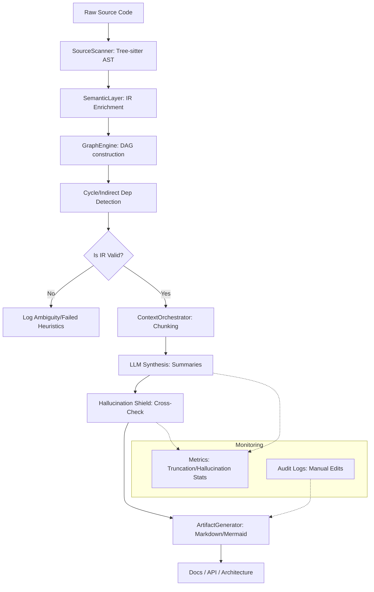

# Technical Plan: Local AI Code Documentation Generator (CodeDocAI) - Ultimate

## 1. PIPELINE VISUALIZATION
The following diagram illustrates the deterministic-first flow of the CodeDocAI engine:

---

## 2. ADVANCED SEMANTIC ANALYSIS
- **Ambiguity Resolution**: Uses "Lexical Scope Mapping" to resolve naming conflicts across files. If unresolved, symbols are flagged as `[[Ambiguous]]` in the IR for manual UI correction.
- **Heuristic Failure Handling**: If the `SemanticLayer` cannot identify a role (e.g., unknown pattern), it assigns a `GenericModule` label and triggers a telemetry log for pattern updates.
- **Validation**: Every language-specific parser must pass a "Round-trip Schema Test" (Source -> IR -> Schema Check).

---

## 3. REPRODUCIBILITY & GENERATION ORDER
- **Deterministic Traversal**: Generation follows a **Topological Sort** of the `DependencyGraph`.
- **Criticality Score**: Calculated as `In-degree * SideEffectWeight`. High-criticality modules are prioritized in the `ARCHITECTURE.md`.
- **Version Control**: Stores a "Project Signature" (hash of all IR states) to ensure docs remain consistent until code changes.

---

## 4. SCALABILITY & HARDWARE STRATEGY
- **Memory Scaling (Large Repos)**:
    - **Tier 1 (<5k nodes)**: In-memory NetworkX graph.
    - **Tier 2 (>5k nodes)**: Disk-backed SQLite graph to prevent OOM errors.
- **Hardware Limits**:
    - **Minimum**: 16GB RAM, 4-core CPU (Llama 3 8B @ ~1-2 tokens/s).
    - **Optimal**: 32GB RAM, NVIDIA GPU (8GB+ VRAM) for Ollama acceleration (>10 tokens/s).
- **Mitigation**: Automated "Sub-tree Scanning" allows processing sub-directories independently on low-end hardware.

---

## 5. UI: INTERACTIVE CORRECTION & AUDIT
- **Undo/Redo**: Implements a Command Pattern state-store for all manual edits to IR or summaries.
- **Audit Logs**: Exportable JSON log showing: `[Timestamp] [File] [Field] [Original AI Value] -> [Manual Correction]`.
- **Metrics Dashboard**:
    - **Truncation Rate**: % of methods whose bodies were stripped due to context window limits.
    - **Hallucination Density**: Number of AI-generated keywords not found in the original IR.

---

## 6. LOGGING & METRICS
- **Cycles**: Logs every detected cycle with a "Path List" for architectural refactoring hints.
- **Missing Deps**: Logs "Broken Links" (e.g., dynamic imports that target non-existent files) for manual path mapping.
- **Performance Profiles**: Generates a `.json` profile of the run (Time per layer: Parsing, Extraction, Graph, LLM).

---

## 7. TESTING STRATEGY
- **Unit Tests**:
    - `test_ir_consistency`: Ensures Python/JS IR exports contain identical keys.
    - `test_heuristic_reliability`: Validates role-detection performance against a "Golden Set" of known libraries.
- **Load Tests**: Profiling runs against medium (10k LOC) and large (100k LOC) open-source repos to validate memory boundaries.
